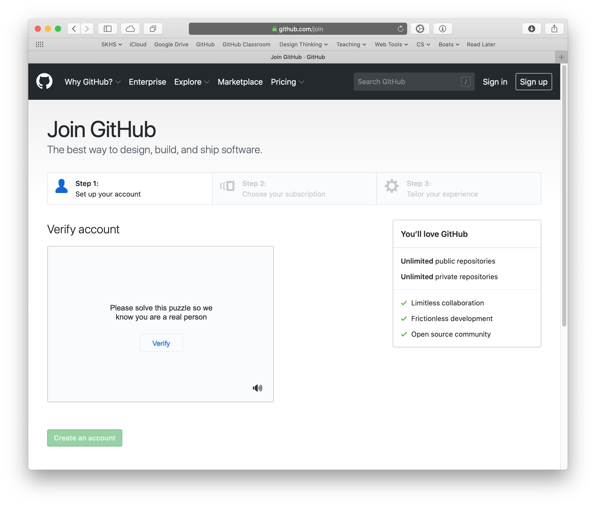
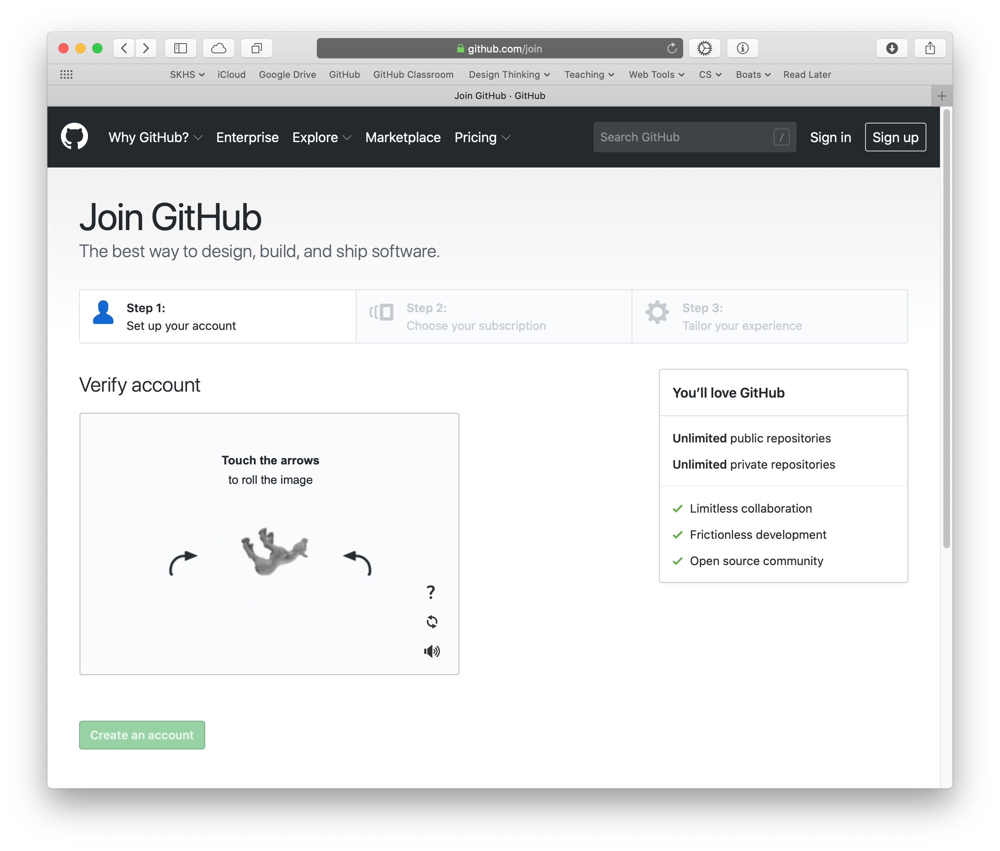

Getting Started With GitHub

---

Prerequisite: a functioning e-mail account that you can reliably access, the account needs to be unique on GitHub. You will need it to verify your GitHub account.

1. Create a GitHub account.
1. Verify your account.
1. Complete your profile.
1. Submit a link to your GitHub profile.

---

Go to: https://github.com

Click on the green **Sign up for GitHub** button.

---

Verify that you're human:
* Click on the **Verify** button.
* Turn the critter right side up. Then click **Done.**

---

Select the free account.

---

