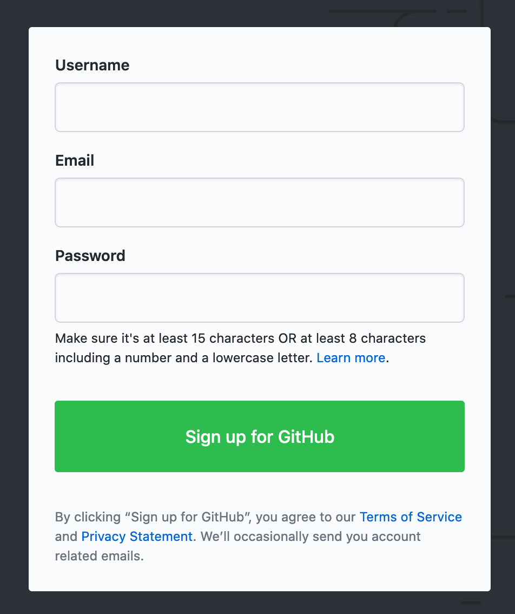

# Instructions

## Create a GitHub account

1. Click on the link to go to [GitHub (https://github.com)][github]. Then:
   - Select a user name that you will be comfortable sharing with colleagues and potential employers. If you can get it your name is a good choice.
   - Enter your e-mail, it will not be publically visible.
   - Enter the password you want to use, make sure it meets the requirements. You may want to type it "in the clear" so that you can be sure it is right. Note that you don't have a password verification box. To fix a typo you will need to verify the account.
   - Solve the puzzle to verify that you are indeed a human (or perhaps an advanced AI).
   - Click the **Sign Up** button
1. After clicking on the Sign Up button, you will be prompted to select an account type, choose the **Free** option. Next, you'll be asked for information about your experience and how you plan to use GitHub (feel free to skip that step).
1. Finally you'll be prompted to verify your account, if you can access your e-mail verify the account now. If you are using your phone to verify the account you may be asked to enter a confirmation code. The code will be sent as another e-mail.
1. Once you have created the account you will prompted to create a repository. Skip that for now.
1. Click on the avatar in the upper right hand corner and choose Settings from the dropdown menu, then enter your name (as I know you). This is especially important if you didn't use your name as your GitHub username.
1. Then choose Profile from the same dropdown – it will take you to your GitHub profile page. **Bookmark this page.**

## Practice with Git and GitHub

Once you have verified your account, go to the [GitHub Guides][gh-guides] page where you will find some quick tutorials to help you start to learn your way around Git and GitHub.

1. Read the [Understanding the GitHub Flow][gh-flow] guide.
1. Then work through the [Hello World][hello-world] guide.
1. After you have finished the Hello World guide, click on your GitHub bookmark to return to your profile and notice that you have a new [contribution square][gh-squares] (you should have at least five contributions).
1. Click on your Hello World repository and you should see that you have, at least, three commits.

Congratulations, you're rolling!

## Notes

[github]: <https://github.com>
[git]: <https://git-scm.com>
[gh-guides]: <https://guides.github.com>
[gh-pages]: <https://pages.github.com>
[hello-world]: <https://guides.github.com/activities/hello-world/>
[gh-flow]: <https://guides.github.com/introduction/flow/>
[setup-gh-pages]: <https://guides.github.com/features/pages/>
[gh-squares]: <https://help.github.com/articles/viewing-contributions-on-your-profile/>
[gfm]: <https://guides.github.com/features/mastering-markdown/>

<!-- Don't edit links here, change them in _data/assignment.yml instead, -->

[slides]: <{{site.data.assignment.slides}}>
[template]: <{{site.data.assignment.template}}>
